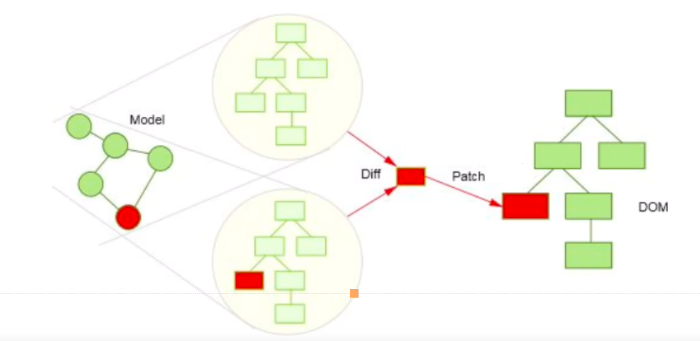

## 生成项目
```
npm install crete-react-app -g
create-react-app dom-diff
```

## virtual-dom
virtual-dom 相关

virtual-dom， 也就是虚拟节点，它通过JS的`Object`对象模拟`DOM`中都节点，然后再通过特定的`render`方法将其渲染成真实的`DOM`节点。

```
createElement -> { type, props, children }
```
-----
```
createElement('ul', { class: 'list' }, [
    createElement('li', { class: 'item' }, '111'),
    createElement('li', { class: 'item' }, '222'),
    createElement('li', { class: 'item' }, '333'),
])
```

## dom-diff

`dom-diff`则是通过JS层面的计算，返回一个`patch`对象，即在通过特定的操作解析`patch`对象，完成页面的重新渲染。

`DOM DIFF`比较二个虚拟DOM区别，就是比较两个对象的区别。
作用：根据两个虚拟对象创建出补丁，描述改变的内容，将这个补丁用来更新DOM



> 差异计算

先序深度优先遍历

1. 用JavaScript对象模拟DOM
2. 把此虚拟DOM转换成真实DOM，并插入页面中
3. 如果有事件发生修改了虚拟DOM比较两颗虚拟DOM树差异，得到差异对象
4. 把差异对象应用到真正的DOM树上
